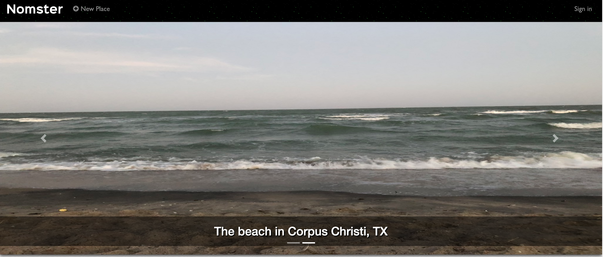

# [Nomster](https://nomster-joe-holley.herokuapp.com/)

A Yelp clone that integrates with the Google Maps API and includes features like user comments, star ratings, image uploading, and user authentication. Ability to add, update, edit and destroy any of your photos, comments, or locations.

#### Built using:
- Ruby v2.5.3
- HTML5
- CSS
- Bootstrap 4.0.0.alpha6
- JQuery
- Popper JS
- Font Awesome
- Google Maps API

#### Ruby Gems used:
- Kaminari
- Carrierwave
- Figaro
- Simple-Form
- Devise

### Home Page:

### Google Maps API:

https://nomster-joe-holley.herokuapp.com/

